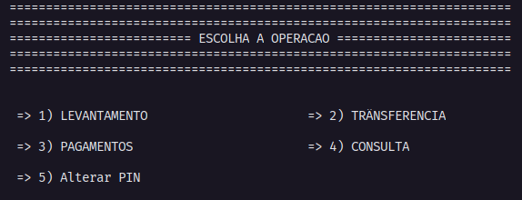

## ATM ##

## Descrição ##
 - Simulação de um sistema de ATM dos Bancos feito em C.

## Opçãos Validas ##

Neste sistema é possivel encontrar as seguintes opções:

 - Levantamento
 - Trâsferencia
 - Consulta
 - Pagamentos
 - Alterar PIN

## Como utilizar ##

Basta rodar o executavel de acordo com seu sistema operacional.

    -Para linux rode o BancoL
    -Para Windows rode o BancoW

# PIN
 O pin pré-difindo é 1234 :)

## Contribuições no Código fonte ##
Esteja avontade ;-) deixe seu pull request